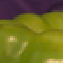

# Zoom-Image-using-0-order-Convolution
Zoom an image using 0 order convolution.

Zoom: Enlarging a section of an image, to improve visual analysis of detailed objects.

Input image:

Output image(Randomly selected starting row, col & height, width values):

